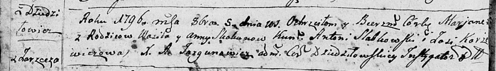
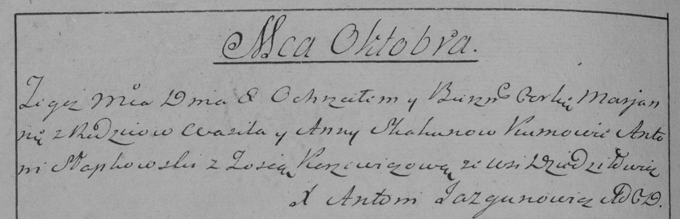
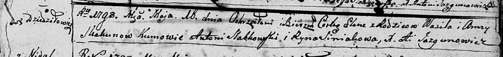
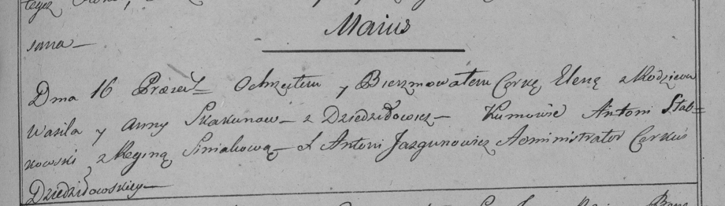

**Скакун Василь (Skakun Wasil)**

5 октября 1796 г -- крещение дочери Марьяны (НИАБ 136-13-894, лист 30об,
№84/1796-р (ориг)), (РГИА 823-2-18, лист 257об, №49/1796-р (коп)).

16 мая 1798 г -- крещение дочери Елены (НИАБ 136-13-894, лист 36,
№20/1798-р (ориг)), (РГИА 823-2-18, лист 263, №19/1798-р (коп)).

**НИАБ 136-13-894:** Лист 30-об. **Метрическая запись №84/1796-р
(ориг).**

Дедиловичская Покровская церковь. 5 октября 1796 года. Метрическая
запись о крещении.

Skakunowna Marjana -- дочь родителей с деревни Дедиловичи.

Skakun Wasil -- отец.

Skakunowa Anna -- мать.

Słabkowski Antoni -- кум.

Karżewiczowa Zosia - кума.

Jazgunowicz Antoni -- ксёндз.

**РГИА 823-2-18:** Лист 257об. **Метрическая запись №49/1796-р (коп).**

Дедиловичская Покровская церковь. \[5\] октября 1796 года. Метрическая
запись о крещении.

Skakunowna Marjanna -- дочь родителей с деревни Дедиловичи.

Skakun Wasil -- отец.

Skakunowa Anna -- мать.

Słapkowski Antoni -- кум.

Korżewiczowa Zosia -- кума.

Jazgunowicz Antoni -- ксёндз.

**НИАБ 136-13-894:** Лист 36. **Метрическая запись №20/1798-р (ориг).**

Дедиловичская Покровская церковь. 16 мая 1798 года. Метрическая запись о
крещении.

Skakunowna Elena -- дочь родителей с деревни Дедиловичи.

Skakun Wasil -- отец.

Skakunowa Anna -- мать.

Słabkowski Antoni - кум.

Siniakowa Ryna - кума.

Jazgunowicz Antoni -- ксёндз.

**РГИА 823-2-18:** Лист 264. **Метрическая запись №20/1798-р (коп).**

Дедиловичская Покровская церковь. 16 мая 1798 года. Метрическая запись о
крещении.

Skakunowna Elena -- дочь родителей с деревни Дедиловичи.

Skakun Wasil -- отец.

Skakunowa Anna -- мать.

Słabkowski Antoni -- кум.

Siniakowa Regina -- кума.

Jazgunowicz Antoni -- ксёндз.
