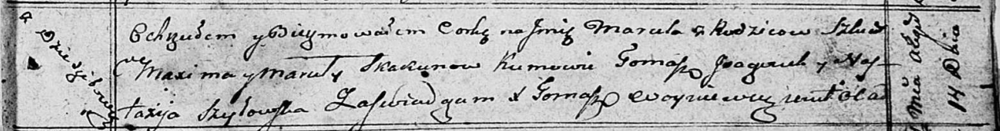

**Скакун Марута (Skakunowa Maruta)**

14 августа 1810 г -- крещение дочери Маруты (НИАБ 136-13-894, лист 78,
№33/1810-р (ориг)).

**НИАБ 136-13-894:** Лист 78. **Метрическая запись №33/1810-р (ориг).**

Осовская Покровская церковь. 14 августа 1810 года. Метрическая запись о
крещении.

Skakunowna Maruta -- дочь родителей с деревни Дедиловичи.

Skakun Maxim -- отец.

Skakunowa Maruta -- мать.

G.. \[Gonczaruk\] Tomasz -- кум.

Szyłowaska Nastazija -- кума.

Woyniewicz Tomasz -- ксёндз.
