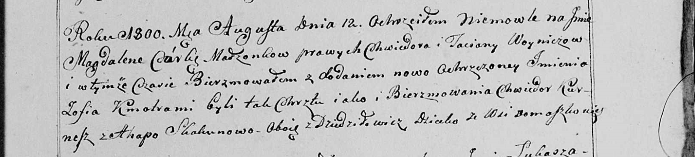

**Скакун Агапа (Skakunowa Ahapa)**

12 августа 1800 г -- крестная мать Магдалены Зофии, дочери Войничев
Хведора и Татьяны с деревни Осово (НИАБ 136-13-949, лист 103, №24/1800-р
(коп)).

**НИАБ 136-13-949:** Лист 103. **Метрическая запись №24/1800-р (коп).**

(См. тж.: РГИА 823-2-18, лист 276об, №21/1800-р (коп), НИАБ 136-13-894,
лист 41об, №22/1800-р (ориг))

{width="6.496527777777778in"
height="1.475in"}

Дедиловичская Покровская церковь. 12 августа 1800 года. Метрическая
запись о крещении.

Woyniczowna Magdalena Zofia -- дочь родителей с деревни Домашковичи
\[Осово\].

Woynicz Chwiedor -- отец.

Woyniczowa Taciana -- мать.

Kurnesz Chwiedor \[Woynicz Siemion\] -- кум, с деревни Дедиловичи.

Skakunowa Ahapa - кума, с деревни Дедиловичи.

Jazgunowicz Antoni -- ксёндз.
