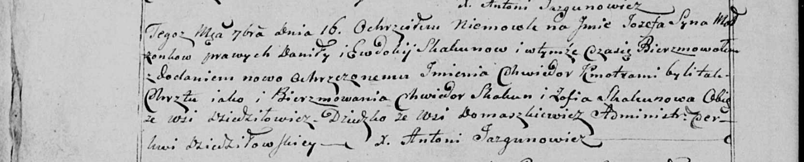

**Скакун Зофия (Skakunowa Zofia)**

16 сентября 1800 г -- крестная мать Иосифа Хведора, сына Скакунов Данилы
и Евдокии с деревни Домашковичи (НИАБ 136-13-949, лист 103об, №27/1800-р
(коп)).

**НИАБ 136-13-949:** Лист 103об. **Метрическая запись №27/1800-р
(коп).**

(См. тж.: НИАБ 136-13-894, лист 42, №24/1800-р (ориг))

Дедиловичская Покровская церковь. 16 сентября 1800 года. Метрическая
запись о крещении.

Skakun Jozef Chwiedor -- сын родителей с деревни Домашковичи.

Skakun Daniła -- отец.

Skakunowa Ewdokia -- мать.

Skakun Chwiedor -- кум, с деревни Дедиловичи.

Skakunowa Zofia - кума, с деревни Дедиловичи.

Jazgunowicz Antoni -- ксёндз.
