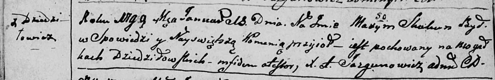
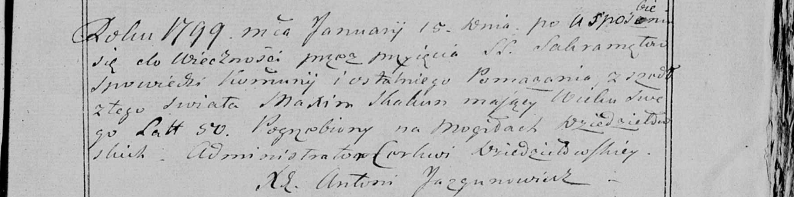

**Скакун Максым (Skakun Maxym)**

13 января 1799 г -- отпевание, умер в возрасте 50 лет (родился около
1749 г) (НИАБ 136-13-919, лист 8об, №1/1799-у (ориг), НИАБ 136-13-938,
лист 8о250б, №1/1799-у (коп)).

**НИАБ 136-13-919:** Лист 8об. **Метрическая запись №1/1799-у (ориг).**

Дедиловичская Покровская церковь. 13 января 1799 года. Метрическая
запись об отпевании.

Skakun Maxym -- умерший, 50 лет, с деревни Дедиловичи, похоронен на
кладбище деревни Дедиловичи.

Jazgunowicz Antoni -- ксёндз.

**НИАБ 136-13-938:** Лист 250. **Метрическая запись №1/1799-у (коп).**

(См. тж. НИАБ 136-13-919, Лист 8об. Метрическая запись №1/1799-у (ориг))

Дедиловичская Покровская церковь. 15 января 1799 года. Метрическая
запись об отпевании.

Skakun Maxim -- умерший, 50 лет, с деревни \[Дедиловичи\], похоронен на
кладбище деревни Дедиловичи.

Jazgunowicz Antoni -- ксёндз.
