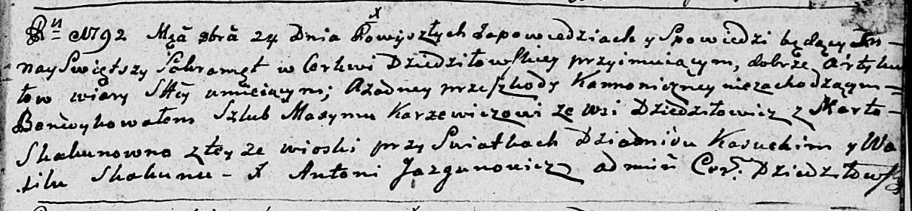

**Скакун (Каржевич) Марта (Karżewiczowa Marta z Skakunow)**

24 октября 1792 г -- венчание с Максымом Каржевичем с деревни Дедиловичи
(НИАБ 136-13-894, лист 71, №11/1792-б (ориг)).

**НИАБ 136-13-894:** Лист 71. **Метрическая запись №11/1792-б (ориг).**

Дедиловичская Покровская церковь. 24 октября 1792 года. Метрическая
запись о венчании.

Karżewicz Maxym -- жених, с деревни Дедиловичи.

Skakunowna Marta -- невеста, с деревни Дедиловичи.

Kasucki Dziamid -- свидетель.

Skakun Wasil -- свидетель.

Jazgunowicz Antoni -- ксёндз.
