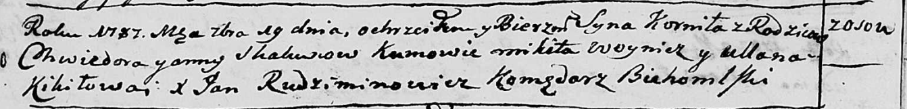

**Скакун Корнил (Skakun Kornił)**

24 апреля 1787 г -- крещение (НИАБ 136-13-894, лист 2об, №45/1787-р
(ориг)).

**НИАБ 136-13-894:** Лист 2об. **Метрическая запись №45/1787-р (ориг).**

{width="6.496527777777778in"
height="0.7891852580927384in"}

Дедиловичская Покровская церковь. 19 сентября 1787 года. Метрическая
запись о крещении.

Skakun Kornił - сын родителей с деревни Дедиловичи.

Skakun Chwiedor -- отец.

Skakunowa Anna -- мать.

Woynicz Mikita - кум.

Kikiłowa Ullana - кума.

Rudziminowicz Jan -- ксёндз, комендант Бегомльской церкви.
