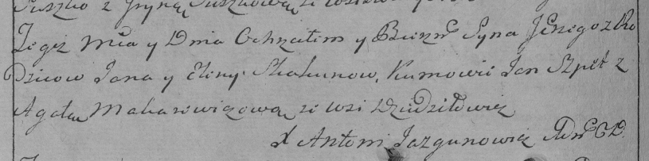

**Скакун Сергей Янов (Skakun Jerzy)**

6 апреля 1796 г -- крещение (НИАБ 136-13-894, лист 29, №44/1796-р
(ориг)), (РГИА 823-2-18, лист 255об, №21/1796-р (коп)).

**НИАБ 136-13-894:** Лист 29. **Метрическая запись №44/1796-р (ориг).**

{width="6.496527777777778in"
height="0.7945494313210849in"}

Дедиловичская Покровская церковь. 6 апреля 1796 года. Метрическая запись
о крещении.

Skakun Jerzy -- сын родителей с деревни Дедиловичи.

Skakun Jan -- отец.

Skakunowa Elena -- мать.

Szpet Jan - кум.

Makarewiczowa Agata - кума.

Jazgunowicz Antoni -- ксёндз.

**РГИА 823-2-18:** Лист 255об. **Метрическая запись №21/1796-р (коп).**

{width="6.496527777777778in"
height="1.6180555555555556in"}

Дедиловичская Покровская церковь. 6 апреля 1796 года. Метрическая запись
о крещении.

Skakun Jerzy -- сын родителей с деревни Дедиловичи.

Skakun Jan -- отец.

Skakunowa Elena -- мать.

Szpet Jan -- кум.

Makarewiczowa Agata -- кума.

Jazgunowicz Antoni -- ксёндз.
