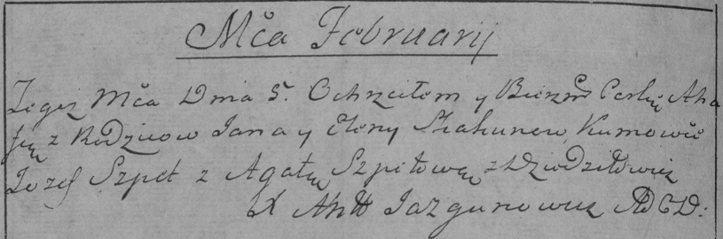
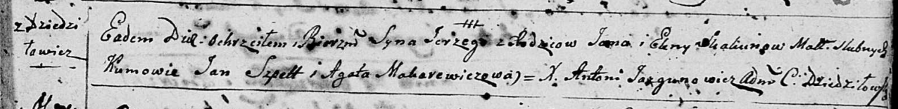

**Скакун Ян (Skakun Jan)**

5 февраля 1785 г -- крещение дочери Агафии (РГИА 823-2-18, лист 228об,
№4/1785-р (коп)).

6 апреля 1796 г -- крещение сына Сергея (НИАБ 136-13-894, лист 29,
№44/1796-р (ориг)), (РГИА 823-2-18, лист 255об, №21/1796-р (коп)).

**РГИА 823-2-18:** Лист 228об. **Метрическая запись №4/1785-р (коп).**

Дедиловичская Покровская церковь. 5 февраля 1785 года. Метрическая
запись о крещении.

Skakunowna Ahafia -- дочь родителей с деревни Дедиловичи.

Skakun Jan -- отец.

Skakunowa Elena -- мать.

Szpet Jozef -- кум.

Szpetowa Agata - кума.

Jazgunowicz Antoni -- ксёндз.

**НИАБ 136-13-894:** Лист 29. **Метрическая запись №44/1796-р (ориг).**

Дедиловичская Покровская церковь. 6 апреля 1796 года. Метрическая запись
о крещении.

Skakun Jerzy -- сын родителей с деревни Дедиловичи.

Skakun Jan -- отец.

Skakunowa Elena -- мать.

Szpet Jan - кум.

Makarewiczowa Agata - кума.

Jazgunowicz Antoni -- ксёндз.

**РГИА 823-2-18:** Лист 255об. **Метрическая запись №21/1796-р (коп).**

Дедиловичская Покровская церковь. 6 апреля 1796 года. Метрическая запись
о крещении.

Skakun Jerzy -- сын родителей с деревни Дедиловичи.

Skakun Jan -- отец.

Skakunowa Elena -- мать.

Szpet Jan -- кум.

Makarewiczowa Agata -- кума.

Jazgunowicz Antoni -- ксёндз.
