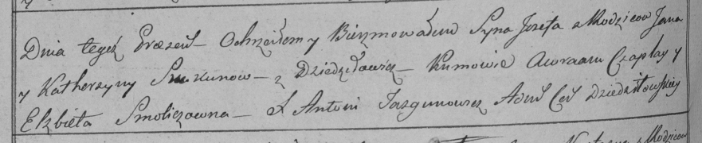

**Скакун Елена Янова (Skakunowna Helena)**

2 марта 1802 г -- крещение (НИАБ 937-4-32, лист 6, №5/1802-р).

**НИАБ 937-4-32:** Лист 6. **Метрическая запись №5/1802-р.**

{width="6.496527777777778in"
height="0.8833333333333333in"}

Дедиловичский костел Наисвятейшего Сердца Иисуса. 2 марта 1802 года.
Метрическая запись о крещении.

Skakunowna Helena -- дочь крестьян с деревни Дедиловичи.

Skakun Joann -- отец.

Skakunowa Catharina -- мать.

Czaplay Abram -- крестный отец, крестьянин, с деревни Дедиловичи.

Holcowa Elisabetha -- крестная мать, с деревни Дедиловичи.

Linhart Hyacinthus -- ксёндз.
