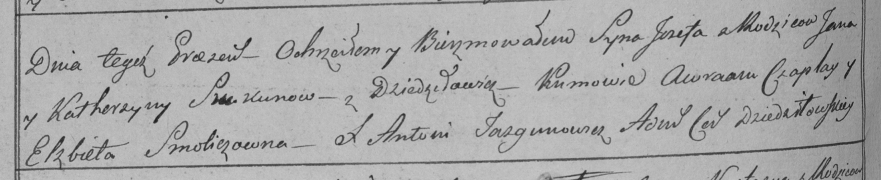

**Скакун (Медвецкая) Катерына (Skakunowa (Medzwecka) Katerzyna)**

14 ноября 1797 г -- венчание с Иваном Скакуном с деревни Дедиловичи
(НИАБ 136-13-920, лист 5, №16/1797-б (ориг)).

10 октября 1798 г -- крещение сына Иосифа (НИАБ 136-13-894, лист 37об,
№53/1798-р (ориг)), (РГИА 823-2-18, лист 266об, №54/1798-р (коп)).

7 июля 1801 -- крестная мать Марты, дочери Леона и Авдоции Шустовских с
деревни Домашковичи (НИАБ 937-4-32, лист 4об, №13/1801-р).

2 марта 1802 г -- крещение дочери Елены (НИАБ 937-4-32, лист 6,
№5/1802-р).

Декабрь 1809 г -- крещение сына Стефан (НИАБ 937-4-32, лист 20об,
№33/1809-р).

**НИАБ 136-13-920:** Лист 5. **Метрическая запись №16/1797-б (ориг).**

{width="6.496527777777778in"
height="1.0506824146981628in"}

Дедиловичская Покровская церковь. 14 ноября 1797 года. Метрическая
запись о венчании.

Skakun Jwan -- жених, с деревни Дедиловичи.

Miedzwecka Katerzyna -- невеста.

Ławusiow Kalist -- свидетель.

Skakun Prokop -- свидетель.

Jazgunowicz Antoni -- ксёндз.

**НИАБ 136-13-894:** Лист 37об. **Метрическая запись №53/1798-р
(ориг).**

{width="6.496527777777778in"
height="1.1016404199475065in"}

Дедиловичская Покровская церковь. 10 октября 1798 года. Метрическая
запись о крещении.

Skakun Jozeff -- сын родителей с деревни Дедиловичи.

Skakun Jan -- отец.

Skakunowa Katerzyna -- мать.

Czaplay Awram - кум.

Smoliczowna Elżbieta - кума.

Jazgunowicz Antoni -- ксёндз.

**РГИА 823-2-18:** Лист 266об. **Метрическая запись №54/1798-р (коп).**

{width="6.496527777777778in"
height="1.3270833333333334in"}

Дедиловичская Покровская церковь. 10 октября 1798 года. Метрическая
запись о крещении.

Skakun Jozef -- сын родителей с деревни Дедиловичи.

Skakun Jan -- отец.

Skakunowa Katerzyna -- мать.

Czaplay Awraam -- кум.

Smoliczowna Elżbieta -- кума.

Jazgunowicz Antoni -- ксёндз.

**НИАБ 937-4-32:** Лист 4об. **Метрическая запись №13/1801-р.**

{width="6.496527777777778in"
height="0.6493055555555556in"}

Дедиловичский костел Наисвятейшего Сердца Иисуса. 7 июля 1801 года.
Метрическая запись о крещении.

Szustowska Marta -- дочь родителей с деревни Домашковичи.

Szustowski Leon -- отец.

Szustowska Audocia -- мать.

Suszko Andreas -- крестный отец, с деревни Разлитье.

Skakunowa Catharina -- крестная мать, с деревни Дедиловичи.

Linhart Hyacinthus -- ксёндз.

**НИАБ 937-4-32:** Лист 6. **Метрическая запись №5/1802-р.**

{width="6.496527777777778in"
height="0.8833333333333333in"}

Дедиловичский костел Наисвятейшего Сердца Иисуса. 2 марта 1802 года.
Метрическая запись о крещении.

Skakunowna Helena -- дочь крестьян с деревни Дедиловичи.

Skakun Joann -- отец.

Skakunowa Catharina -- мать.

Czaplay Abram -- крестный отец, крестьянин, с деревни Дедиловичи.

Holcowa Elisabetha -- крестная мать, с деревни Дедиловичи.

Linhart Hyacinthus -- ксёндз.

**НИАБ 937-4-32:** Лист 20об. **Метрическая запись №33/1809-р.**

{width="6.496527777777778in"
height="1.5368055555555555in"}

Дедиловичский костел Наисвятейшего Сердца Иисуса. Декабря 1809 года.
Метрическая запись о крещении.

Skakun Stephan -- сын крестьян с деревни Дедиловичи.

Skakun Joann -- отец.

Skakunowa Catharina -- мать.

Czaplay Auram -- крестный отец, с деревни Дедиловичи.

Holcowa Elisabetha -- крестная мать, с деревни Дедиловичи.

Miszkun Marcus -- ксёндз, комендант Дедиловичский.
