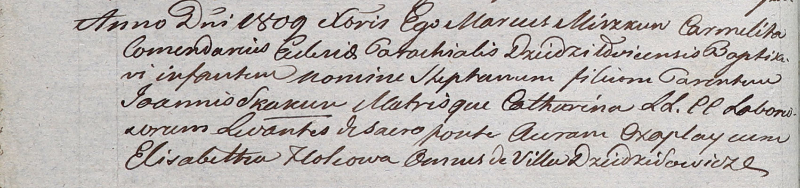

**Скакун Стефан Янов (Skakun Stephan)**

Декабрь 1809 г -- крещение (НИАБ 937-4-32, лист 20об, №33/1809-р).

**НИАБ 937-4-32:** Лист 20об. **Метрическая запись №33/1809-р.**

Дедиловичский костел Наисвятейшего Сердца Иисуса. Декабря 1809 года.
Метрическая запись о крещении.

Skakun Stephan -- сын крестьян с деревни Дедиловичи.

Skakun Joann -- отец.

Skakunowa Catharina -- мать.

Czaplay Auram -- крестный отец, с деревни Дедиловичи.

Holcowa Elisabetha -- крестная мать, с деревни Дедиловичи.

Miszkun Marcus -- ксёндз, комендант Дедиловичский.
