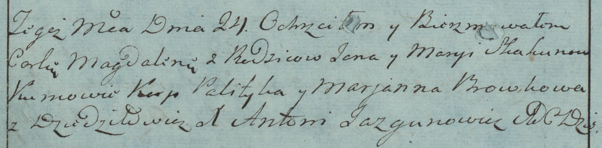

**Скакун Магдалена Янова (Skakunowna Magdalena)**

24 июля 1783 г -- крещение (РГИА 823-2-18, лист 224об, №20/1783-р
(коп)).

**РГИА 823-2-18:** Лист 224об. **Метрическая запись №20/1783-р (коп).**

{width="6.496527777777778in"
height="1.6104166666666666in"}

Дедиловичская Покровская церковь. 24 июля 1783 года. Метрическая запись
о крещении.

Skakunowna Magdalena -- дочь родителей с деревни Дедиловичи.

Skakun Jan -- отец.

Skakunowa Marya -- мать.

Polityka Karp? -- кум.

Browkowa Marjanna - кума.

Jazgunowicz Antoni -- ксёндз.
