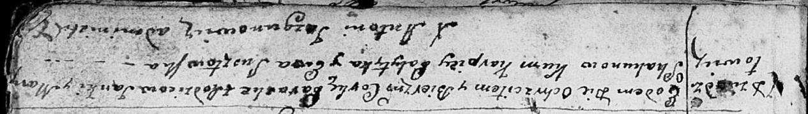

**Скакун Параска Янова (Skakunowna Paraska)**

11 ноября 1791 г -- крещение (НИАБ 136-13-894, лист 14, №56/1791-р
(ориг)).

**НИАБ 136-13-894:** Лист 14. **Метрическая запись №56/1791-р (ориг).**

{width="6.496527777777778in"
height="0.9192629046369204in"}

Дедиловичская Покровская церковь. 11 ноября 1791 года. Метрическая
запись о крещении.

Skakunowna Paraska -- дочь родителей с деревни Дедиловичи.

Skakun Janka -- отец.

Skakunowa Marya -- мать.

Palytyka Karpiey - кум.

Susztowska Ewa - кума.

Jazgunowicz Antoni -- ксёндз.
