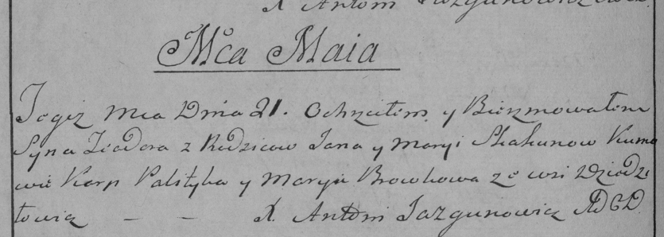

**Скакун Тодор Янов (Skakun Todor)**

21 мая 1786 г -- крещение (РГИА 823-2-18, лист 231об, №14/1786-р (коп)).

**РГИА 823-2-18:** Лист 231об. **Метрическая запись №14/1786-р (коп).**

{width="6.496527777777778in"
height="2.31875in"}

Дедиловичская Покровская церковь. 21 мая 1786 года. Метрическая запись о
крещении.

Skakun Teodor -- сын родителей с деревни Дедиловичи.

Skakun Jan -- отец.

Skakunowa Marya -- мать.

Palityka Karp -- кум.

Browkowa Marya - кума.

Jazgunowicz Antoni -- ксёндз.
