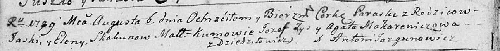

**Скакун Параска Яськова (Skakunowna Paraska)**

6 августа 1789 г -- крещение (НИАБ 136-13-894, лист 7об, №38/1789-р
(ориг)), (РГИА 823-2-18, лист 238об, №18/1789-р (коп)).

**НИАБ 136-13-894:** Лист 7об. **Метрическая запись №38/1789-р (ориг).**

{width="6.496527777777778in"
height="0.6644706911636046in"}

Дедиловичская Покровская церковь. 6 августа 1789 года. Метрическая
запись о крещении.

Skakunowna Paraska -- дочь родителей с деревни Дедиловичи.

Skakun Jaśka -- отец.

Skakunowa Elena -- мать.

Zys Jozef - кум.

Makarewiczowa Agata - кума.

Jazgunowicz Antoni -- ксёндз.

**РГИА 823-2-18:** Лист 238об. **Метрическая запись №18/1789-р (коп).**

{width="6.496527777777778in"
height="1.775in"}

Дедиловичская Покровская церковь. 6 августа 1789 года. Метрическая
запись о крещении.

Skakunowna Paraska -- дочь родителей с деревни Дедиловичи.

Skakun Jan \[Jaśka\] -- отец.

Skakunowa Elena -- мать.

Zyz Jozef -- кум.

Makarewiczowa Agata - кума.

Jazgunowicz Antoni -- ксёндз.
