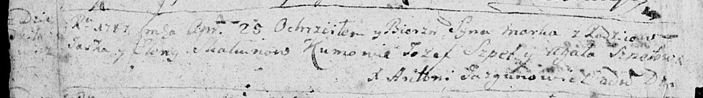
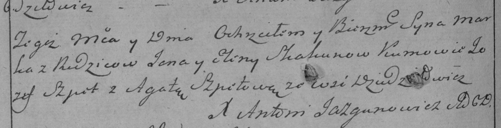
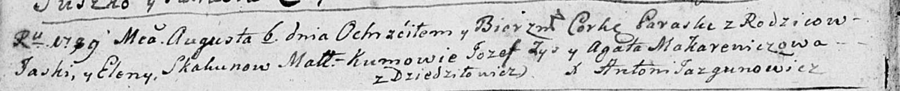
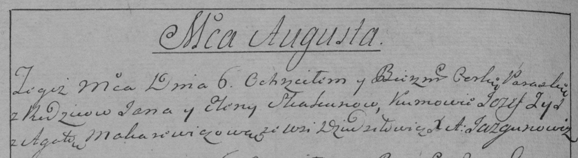

**Скакун Яська (Skakun Jaśka, Jaś)**

24 апреля 1787 г -- крещение сына Марка (НИАБ 136-13-894, лист 1об,
№16/1787-р (ориг)), (РГИА 823-2-18, лист 233об, №12/1787-р (коп)).

6 августа 1789 г -- крещение дочери Параски (НИАБ 136-13-894, лист 7об,
№38/1789-р (ориг)), (РГИА 823-2-18, лист 238об, №18/1789-р (коп)).

**НИАБ 136-13-894:** Лист 1об. **Метрическая запись №16/1787-р (ориг).**

Дедиловичская Покровская церковь. 25 апреля 1787 года. Метрическая
запись о крещении.

Skakun Marko -- сын родителей с деревни Дедиловичи.

Skakun Jaśka -- отец.

Skakunowa Elena -- мать.

Szpet Jozef - кум.

Szpetowa Agata - кума.

Jazgunowicz Antoniusz -- ксёндз.

Лист 233об. **Метрическая запись №12/1787-р (коп).**

Дедиловичская Покровская церковь. 30 апреля 1787 года. Метрическая
запись о крещении.

Skakun Marko -- сын родителей с деревни Дедиловичи.

Skakun Ja\[ś\] -- отец.

Skakunowa Elena -- мать.

Szpet Jozef -- кум.

Szpetowa Agata - кума.

Jazgunowicz Antoni -- ксёндз.

**НИАБ 136-13-894:** Лист 7об. **Метрическая запись №38/1789-р (ориг).**

Дедиловичская Покровская церковь. 6 августа 1789 года. Метрическая
запись о крещении.

Skakunowna Paraska -- дочь родителей с деревни Дедиловичи.

Skakun Jaśka -- отец.

Skakunowa Elena -- мать.

Zys Jozef - кум.

Makarewiczowa Agata - кума.

Jazgunowicz Antoni -- ксёндз.

**РГИА 823-2-18:** Лист 238об. **Метрическая запись №18/1789-р (коп).**

Дедиловичская Покровская церковь. 6 августа 1789 года. Метрическая
запись о крещении.

Skakunowna Paraska -- дочь родителей с деревни Дедиловичи.

Skakun Jan \[Jaśka\] -- отец.

Skakunowa Elena -- мать.

Zyz Jozef -- кум.

Makarewiczowa Agata - кума.

Jazgunowicz Antoni -- ксёндз.
