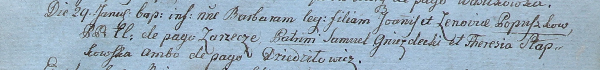

**Слабковская Тереса (Słabkowska Teresa, Teresia)**

28 февраля 1794 г -- крещение сына Василя (НИАБ 136-13-894, лист 21об,
№12/1794-р (ориг)), (РГИА 823-2-18, лист 249об, №8/1794-р (коп)).

29 января 1800 г -- крестная мать Барбары, дочери Иоанна и Зеновии
Папушек с деревни Заречье (НИАБ 937-4-32, лист 1, №2/1800-р).

20 октября 1801 г -- крестная мать Винцентия, сына Юрки и Химы Маковских
с деревни Пядань (НИАБ 937-4-32, лист 4об, №21/1801-р).

4 июля 1802 г -- крестная мать Паулины, дочери Гаврылы и Евфрозыны
Камизёнков с деревни Дедиловичи (НИАБ 937-4-32, лист 6об, №19/1802-р).

7 февраля 1803 г -- крестная мать Базыля Грыгора, сына Ластовских Сымона
и Марьяны с деревни Дедиловичи (НИАБ 136-13-894, лист 49об, №5/1803-р
(ориг)).

17 марта 1807 г -- крестная мать у Алексея Балтромея, сына Ластовских
Сымона и Марьяны с деревни Отруб (НИАБ 136-13-894, лист 62об, №18/1807-р
(ориг)).

**НИАБ 136-13-894:** Лист 21-об. **Метрическая запись №12/1794-р
(ориг).**

{width="6.496527777777778in"
height="1.315531496062992in"}

Дедиловичская Покровская церковь. 28 февраля 1794 года. Метрическая
запись о крещении.

Słabkowski Wasyl -- сын родителей с деревни Дедиловичи.

Słabkowski Antoni -- отец.

Słabkowska Teresa -- мать.

Browka Paweł - кум.

Juchniewiczowa Marta - кума.

Jazgunowicz Antoni -- ксёндз.

**РГИА 823-2-18:** Лист 249об. **Метрическая запись №8/1794-р (коп).**

{width="6.496527777777778in"
height="1.4756944444444444in"}

Дедиловичская Покровская церковь. 28 февраля 1794 года. Метрическая
запись о крещении.

Słabkowski Wasil -- сын родителей с деревни Дедиловичи.

Słabkowski Antoni -- отец.

Słabkowska Teresa -- мать.

Browka Paweł -- кум.

Juchniewiczowa Marta -- кума.

Jazgunowicz Antoni -- ксёндз.

**НИАБ 937-4-32:** Лист 1. **Метрическая запись №2/1800-р.**

{width="6.496527777777778in"
height="0.7604166666666666in"}

Дедиловичский костел Наисвятейшего Сердца Иисуса. 29 января 1800 года.
Метрическая запись о крещении.

Popuszkowna Barbara -- дочь крестьян с деревни Заречье.

Popuszka Joann -- отец.

Popuszkowa Zenovia -- мать.

Gniezdecki Samuel -- крестный отец, с деревни Дедиловичи.

Słapkowska Theresia -- крестная мать, с деревни Дедиловичи.

Linhart Hyacinthus -- ксёндз.

**НИАБ 937-4-32:** Лист 4об. **Метрическая запись №21/1801-р.**

{width="6.496527777777778in"
height="0.7291666666666666in"}

Дедиловичский костел Наисвятейшего Сердца Иисуса. 20 октября 1801 года.
Метрическая запись о крещении.

Makowski Vincentium -- сын вольных людей с деревни Пядань.

Makowski Georgi -- отец.

Makowska Chimka z Korenżankow -- мать.

Szydłowski Stanisław -- крестный отец, с деревни Шилы.

Słabkowska Teresia -- крестная мать, с деревни Дедиловичи.

Linhart Hyacinthus -- ксёндз.

**НИАБ 136-13-894:** Лист 49об. **Метрическая запись №5/1803-р (ориг).**

{width="6.496527777777778in"
height="1.3886165791776028in"}

Дедиловичская Покровская церковь. 7 февраля 1803 года. Метрическая
запись о крещении.

Łastowski Bazyli Hryhory -- сын родителей с деревни Дедиловичи.

Łastowski Symon -- отец.

Łastowska Marjana -- мать.

Szumski Michał -- кум, с деревни Заречье.

Slabkowska Teresia -- кума, с деревни Дедиловичи.

Jazgunowicz Antoni -- ксёндз.

**НИАБ 136-13-894:** Лист 62об. **Метрическая запись №18/1807-р
(ориг).**

{width="6.496527777777778in"
height="1.247810586176728in"}

Дедиловичская Покровская церковь. 17 марта 1807 года. Метрическая запись
о крещении.

Ła\[st\]owski Alexiey Bałtromiey -- сын родителей с деревни Отруб.

Ła\[st\]owski Symon -- отец.

Ła\[st\]owska Marjana -- мать.

Bielawski Wasil -- кум, со двора Дедиловичского.

Słapkowska Teresa -- кума, с деревня Дедиловичи.

Jazgunowicz Antoni -- ксёндз.

**НИАБ 937-4-32:** Лист 6об. **Метрическая запись №19/1802-р.**

{width="6.496527777777778in"
height="1.054861111111111in"}

Дедиловичский костел Наисвятейшего Сердца Иисуса. 4 июля 1802 года.
Метрическая запись о крещении.

Komisionkowna Paulina -- дочь крестьян с деревни Дедиловичи.

Kamisionek Hauryła -- отец.

Kamisionkowa Euphrosina -- мать.

Hnezdzicki Samuel -- крестный отец, крестьянин.

Słabkowska Theresia -- крестная мать, крестьянка, с деревни Дедиловичи.

Linhart Hyacinthus -- ксёндз.
