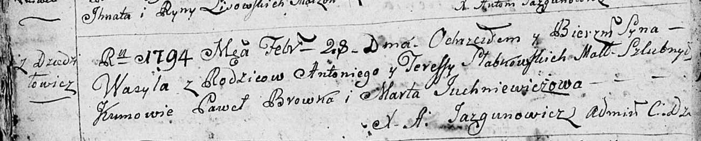
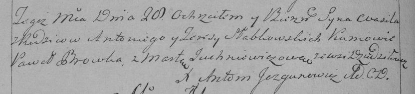
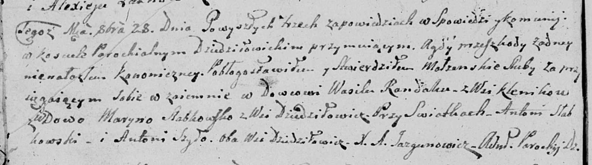
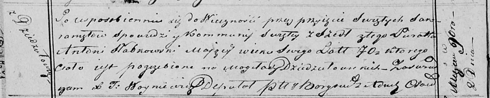

**Слабковский Антон (Słabkowski Antoni)**

28 февраля 1794 г -- крещение сына Василя (НИАБ 136-13-894, лист 21об,
№12/1794-р (ориг)), (РГИА 823-2-18, лист 249об, №8/1794-р (коп)).

23 октября 1799 г -- кум при крещении дочери Марцеллы у Кушнеревичей
Гарасима и Марты (НИАБ 136-13-894, лист 40, №44/1799-р (ориг), НИАБ
136-13-938, лист 244об, №41/1799-р (коп)).

28 октября 1807 г -- свидетель венчания вдовца Василя Рандака с деревни
Клинники с вдовой Марыной Слабковской с деревни Дедиловичи (НИАБ
136-13-920, лист 12об, №5/1807-б (ориг)).

2 ноября 1819 г -- отпевание, умер в возрасте 70 лет (родился около 1749
г) (НИАБ 136-13-919, лист 32об, №4/1819-у (ориг)).

**НИАБ 136-13-894:** Лист 21-об. **Метрическая запись №12/1794-р
(ориг).**

Дедиловичская Покровская церковь. 28 февраля 1794 года. Метрическая
запись о крещении.

Słabkowski Wasyl -- сын родителей с деревни Дедиловичи.

Słabkowski Antoni -- отец.

Słabkowska Teresa -- мать.

Browka Paweł - кум.

Juchniewiczowa Marta - кума.

Jazgunowicz Antoni -- ксёндз.

**РГИА 823-2-18:** Лист 249об. **Метрическая запись №8/1794-р (коп).**

Дедиловичская Покровская церковь. 28 февраля 1794 года. Метрическая
запись о крещении.

Słabkowski Wasil -- сын родителей с деревни Дедиловичи.

Słabkowski Antoni -- отец.

Słabkowska Teresa -- мать.

Browka Paweł -- кум.

Juchniewiczowa Marta -- кума.

Jazgunowicz Antoni -- ксёндз.

**НИАБ 136-13-894:** Лист 40. **Метрическая запись №44/1799-р (ориг).**

Дедиловичская Покровская церковь. 23 октября 1799 года. Метрическая
запись о крещении.

Kuszniarewiczowna Marcella -- дочь родителей с деревни Дедиловичи.

Kuszniarewicz Harasim -- отец.

Kuszniarewiczowa Marta -- мать.

Słapkowski Antoni -- кум, с деревни Дедиловичи.

Pupuszkowa Agata -- кума, с деревни Дедиловичи.

Jazgunowicz Antoni -- ксёндз.

**НИАБ 136-13-938:** Лист 244об. **Метрическая запись №41/1799-р
(коп).**

(См. тж. НИАБ 136-13-894, лист 40, №44/1799-р (ориг); РГИА 823-2-18,
лист 273, №43/1799-р (коп))

Дедиловичская Покровская церковь. 23 октября 1799 года. Метрическая
запись о крещении.

Kuszniarewiczowa Marcellа Małgorzata -- дочь родителей с деревни
\[Дедиловичи\].

Kuszniarewicz Harasim -- отец.

Kuszniarewiczowa Marta -- мать.

Słabkowski Antoni -- кум, с деревня Дедиловичи.

Pupuszkowa Agata - кума, с деревня Дедиловичи.

Jazgunowicz Antoni -- ксёндз.

**НИАБ 136-13-920:** Лист 12об. **Метрическая запись №6/1807-б (ориг).**

Дедиловичская Покровская церковь. 28 октября 1807 года. Метрическая
запись о венчании.

Randak Wasil -- жених, вдовец, с деревни Клинники.

Słabkowska Maryna -- невеста, вдова, с деревни Дедиловичи.

Słabkowski Antoni -- свидетель, с деревни Дедиловичи.

Szyło Antoni -- свидетель, с деревни Дедиловичи.

Jazgunowicz Antoni -- ксёндз.

**НИАБ 136-13-919:** Лист 32об. **Метрическая запись №4/1819-у (ориг).**

Осовская униатская церковь. 2 ноября 1819 года. Метрическая запись об
отпевании.

Słabkowski Antoni -- умерший, 70 лет, с деревни Дедиловичи, похоронен на
кладбище деревни Дедиловичи.

Woyniewicz Tomasz -- ксёндз.
