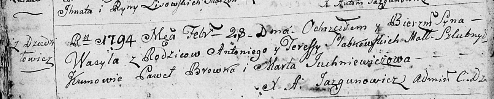
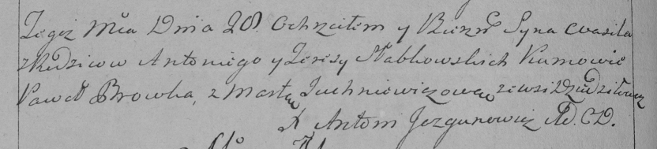

**Слабковский Василь Антонов (Słabkowski Wasil)**

28 февраля 1794 г -- крещение (НИАБ 136-13-894, лист 21об, №12/1794-р
(ориг)), (РГИА 823-2-18, лист 249об, №8/1794-р (коп)).

**НИАБ 136-13-894:** Лист 21-об. **Метрическая запись №12/1794-р
(ориг).**

Дедиловичская Покровская церковь. 28 февраля 1794 года. Метрическая
запись о крещении.

Słabkowski Wasyl -- сын родителей с деревни Дедиловичи.

Słabkowski Antoni -- отец.

Słabkowska Teresa -- мать.

Browka Paweł - кум.

Juchniewiczowa Marta - кума.

Jazgunowicz Antoni -- ксёндз.

**РГИА 823-2-18:** Лист 249об. **Метрическая запись №8/1794-р (коп).**

Дедиловичская Покровская церковь. 28 февраля 1794 года. Метрическая
запись о крещении.

Słabkowski Wasil -- сын родителей с деревни Дедиловичи.

Słabkowski Antoni -- отец.

Słabkowska Teresa -- мать.

Browka Paweł -- кум.

Juchniewiczowa Marta -- кума.

Jazgunowicz Antoni -- ксёндз.
