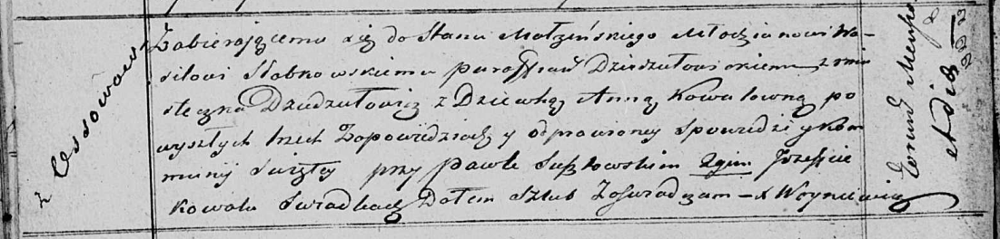

**Слабковский Василь (Słabkowski Wasil)**

13 ноября 1820 г -- венчание с девкой Анной Коваль с деревни Осово (НИАБ
136-13-920, лист 27об, №11/1820-б (ориг)).

**НИАБ 136-13-920:** Лист 27об. **Метрическая запись №11/1820-б
(ориг).**

Осовская Покровская церковь. 13 ноября 1820 года. Запись о венчании.

Słabkowski Wasil -- жених, молодой, парафии Дедиловичской католической,
с местечка Дедиловичи.

Kowalowna Anna -- невеста, девка, с деревни Осово.

Susztowski Paweł -- свидетель.

Kowal Jozef -- свидетель.

Woyniewicz Tomasz -- ксёндз.
