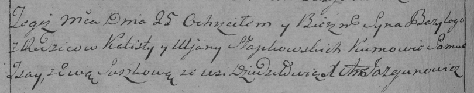

**Слабковский Базыль Калютов (Słapkowski Bazyli)**

25 июля 1795 г -- крещение сына Базыля (НИАБ 136-13-894, лист 24об,
№24/1795-р (ориг)), (РГИА 823-2-18, лист 252об, №19/1795-р (коп)).

Лист 24об. **Метрическая запись №24/1795-р (ориг).**

Дедиловичская Покровская церковь. 25 июля 1795 года. Метрическая запись
о крещении.

Słabkowski Bazyli -- сын родителей с деревни Дедиловичи.

Słabkowski Kalist -- отец.

Słabkowska Ullana -- мать.

Jsay Samuś - кум.

Suszkowa Ewa - кума.

Jazgunowicz Antoni -- ксёндз.

**РГИА 823-2-18:** Лист 252об. **Метрическая запись №19/1795-р (коп).**

Дедиловичская Покровская церковь. 25 июля 1795 года. Метрическая запись
о крещении.

Słapkowski Bazyli -- сын родителей с деревни Дедиловичи.

Słapkowski Kalist -- отец.

Słapkowska Uljana -- мать.

Jsay Samus -- кум.

Suszkowa Ewa -- кума.

Jazgunowicz Antoni -- ксёндз.
