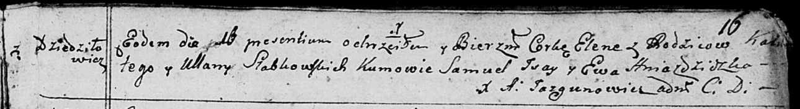

**Слабковская Елена Калютова (Słapkowska Elena)**

16 мая 1792 г -- крещение (НИАБ 136-13-894, лист 16, №26/1792-р (ориг)).

**НИАБ 136-13-894:** Лист 16. **Метрическая запись №26/1792-р (ориг).**

Дедиловичская Покровская церковь. 16 мая 1792 года. Метрическая запись о
крещении.

Słabkowska Elena -- дочь родителей с деревни Дедиловичи.

Słabkowski Kaluta -- отец.

Słabkowska Ullana -- мать.

Jsay Samuel - кум.

Hniazdzicka Ewa - кума.

Jazgunowicz Antoni -- ксёндз.
