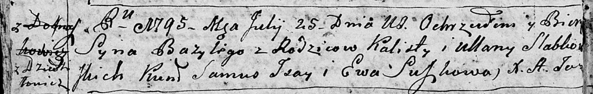

**Слабковский Калюта (Słapkowski Kaluta, Kalist)**

5 ноября 1788 г -- венчание с Ульяной Каржевич (НИАБ 136-13-894, лист
67, №13/1788-б (ориг)).

16 мая 1792 г -- крещение дочери Елены (НИАБ 136-13-894, лист 16,
№26/1792-р (ориг)).

25 июля 1795 г -- крещение сына Базыля (НИАБ 136-13-894, лист 24об,
№24/1795-р (ориг)), (РГИА 823-2-18, лист 252об, №19/1795-р (коп)).

5 декабря 1801 г -- крещение сына Миколая Наума (НИАБ 136-13-894, лист
45, №33/1801-р (ориг)).

16 октября 1804 г -- крещение сына Томаша Винцента (НИАБ 136-13-894,
лист 55, №46/1804-р (ориг)).

**НИАБ 136-13-894:** Лист 67. **Метрическая запись №13/1788-б (ориг).**

{width="6.496527777777778in"
height="1.4858398950131233in"}

Дедиловичская Покровская церковь. 5 ноября 1788 года. Метрическая запись
о венчании.

Słabkowski Kalist -- жених, с деревни Дедиловичи.

Karżewiczowa Ullana -- невеста.

Karżewicz Leon -- свидетель.

Karżewicz Awram -- свидетель.

Jazgunowicz Antoni -- ксёндз.

**НИАБ 136-13-894:** Лист 16. **Метрическая запись №26/1792-р (ориг).**

{width="6.496527777777778in"
height="0.8964654418197725in"}

Дедиловичская Покровская церковь. 16 мая 1792 года. Метрическая запись о
крещении.

Słabkowska Elena -- дочь родителей с деревни Дедиловичи.

Słabkowski Kaluta -- отец.

Słabkowska Ullana -- мать.

Jsay Samuel - кум.

Hniazdzicka Ewa - кума.

Jazgunowicz Antoni -- ксёндз.

**НИАБ 136-13-894:** Лист 24об. **Метрическая запись №24/1795-р
(ориг).**

{width="6.496527777777778in"
height="1.0345898950131234in"}

Дедиловичская Покровская церковь. 25 июля 1795 года. Метрическая запись
о крещении.

Słabkowski Bazyli -- сын родителей с деревни Дедиловичи.

Słabkowski Kalist -- отец.

Słabkowska Ullana -- мать.

Jsay Samuś - кум.

Suszkowa Ewa - кума.

Jazgunowicz Antoni -- ксёндз.

**РГИА 823-2-18:** Лист 252об. **Метрическая запись №19/1795-р (коп).**

{width="6.496527777777778in"
height="1.2833333333333334in"}

Дедиловичская Покровская церковь. 25 июля 1795 года. Метрическая запись
о крещении.

Słapkowski Bazyli -- сын родителей с деревни Дедиловичи.

Słapkowski Kalist -- отец.

Słapkowska Uljana -- мать.

Jsay Samus -- кум.

Suszkowa Ewa -- кума.

Jazgunowicz Antoni -- ксёндз.

**НИАБ 136-13-894:** Лист 45. **Метрическая запись №33/1801-р (ориг).**

{width="6.496527777777778in"
height="1.5535608048993876in"}

Дедиловичская Покровская церковь. 5 декабря 1801 года. Метрическая
запись о крещении.

Słapkowski Mikołay Naum -- сын родителей \[с деревни Дедиловичи\].

Słapkowski Kalist -- отец.

Słapkowska Ullana -- мать.

Susztowski Leon -- кум.

Kuryliczowa Ryna -- кума.

Jazgunowicz Antoni -- ксёндз.

**НИАБ 136-13-894:** Лист 55. **Метрическая запись №46/1804-р (ориг).**

{width="6.496527777777778in"
height="0.8260629921259842in"}

Дедиловичская Покровская церковь. 16 октября 1804 года. Метрическая
запись о крещении.

Słapkowski Tomasz Wincenty -- сын родителей с деревни Дедиловичи.

Słapkowski Kaluta -- отец.

Słapkowska Ullana -- мать.

Szustowski Leon -- кум.

Suszkowa Jryna -- кума.

Jazgunowicz Antoni -- ксёндз.
