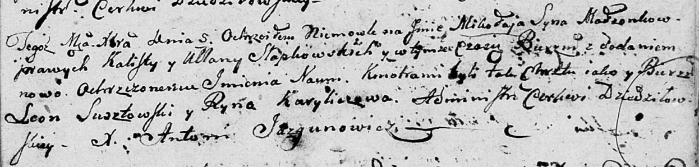

**Слабковский Миколай Калютов (Słapkowski Mikołay Naum)**

5 декабря 1801 г -- крещение сына Миколая Наума (НИАБ 136-13-894, лист
45, №33/1801-р (ориг)).

**НИАБ 136-13-894:** Лист 45. **Метрическая запись №33/1801-р (ориг).**

Дедиловичская Покровская церковь. 5 декабря 1801 года. Метрическая
запись о крещении.

Słapkowski Mikołay Naum -- сын родителей \[с деревни Дедиловичи\].

Słapkowski Kalist -- отец.

Słapkowska Ullana -- мать.

Susztowski Leon -- кум.

Kuryliczowa Ryna -- кума.

Jazgunowicz Antoni -- ксёндз.
