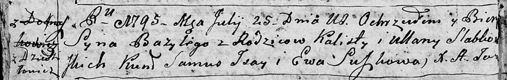

**Слабковский Томаш Калютов (Słapkowski Tomasz Wincenty)**

16 октября 1804 г -- крещение (НИАБ 136-13-894, лист 55, №46/1804-р
(ориг)).

**НИАБ 136-13-894:** Лист 16. **Метрическая запись №26/1792-р (ориг).**

Дедиловичская Покровская церковь. 16 мая 1792 года. Метрическая запись о
крещении.

Słabkowska Elena -- дочь родителей с деревни Дедиловичи.

Słabkowski Kaluta -- отец.

Słabkowska Ullana -- мать.

Jsay Samuel - кум.

Hniazdzicka Ewa - кума.

Jazgunowicz Antoni -- ксёндз.

**НИАБ 136-13-894:** Лист 24об. **Метрическая запись №24/1795-р
(ориг).**

Дедиловичская Покровская церковь. 25 июля 1795 года. Метрическая запись
о крещении.

Słabkowski Bazyli -- сын родителей с деревни Дедиловичи.

Słabkowski Kalist -- отец.

Słabkowska Ullana -- мать.

Jsay Samuś - кум.

Suszkowa Ewa - кума.

Jazgunowicz Antoni -- ксёндз.

**НИАБ 136-13-894:** Лист 45. **Метрическая запись №33/1801-р (ориг).**

Дедиловичская Покровская церковь. 5 декабря 1801 года. Метрическая
запись о крещении.

Słapkowski Mikołay Naum -- сын родителей \[с деревни Дедиловичи\].

Słapkowski Kalist -- отец.

Słapkowska Ullana -- мать.

Susztowski Leon -- кум.

Kuryliczowa Ryna -- кума.

Jazgunowicz Antoni -- ксёндз.

**НИАБ 136-13-894:** Лист 55. **Метрическая запись №46/1804-р (ориг).**

Дедиловичская Покровская церковь. 16 октября 1804 года. Метрическая
запись о крещении.

Słapkowski Tomasz Wincenty -- сын родителей с деревни Дедиловичи.

Słapkowski Kaluta -- отец.

Słapkowska Ullana -- мать.

Szustowski Leon -- кум.

Suszkowa Jryna -- кума.

Jazgunowicz Antoni -- ксёндз.
