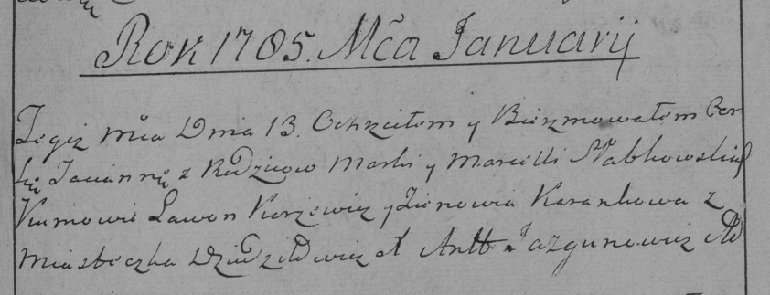
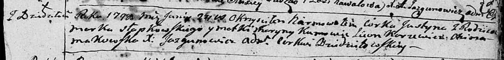

**Слабковская Тацяна Маркова (Słabkowska Tacianna)**

13 января 1785 г -- крещение (РГИА 823-2-18, лист 228, №1/1785-р (коп)).

**РГИА 823-2-18:** Лист 222об. **Метрическая запись №7/1782-р (коп).**

Дедиловичская униатская церковь. 5 октября 1782 года. Метрическая запись
о крещении.

Słabkowski Tomasz -- сын родителей с местечка Дедиловичи.

Słabkowski Marko -- отец.

Słabkowska Marta -- мать.

Karżewicz Leon -- кум.

Karanowa Zynowia - кума.

Jazgunowicz Antoni -- ксёндз.

**РГИА 823-2-18:** Лист 228. **Метрическая запись №1/1785-р (коп).**

Дедиловичская Покровская церковь. 13 января 1785 года. Метрическая
запись о крещении.

Słabkowska Tacianna -- дочь родителей с местечка Дедиловичи.

Słabkowski Marko -- отец.

Słabkowska Marcella -- мать.

Karżewicz Lawon -- кум.

Karankowa Zienowia - кума.

Jazgunowicz Antoni -- ксёндз.

**НИАБ 136-13-894:** Лист 20-об. **Метрическая запись №70/1793-р
(ориг).**

Дедиловичская Покровская церковь. 9 октября 1793 года. Метрическая
запись о крещении.

Słapkowski Jan -- сын родителей с деревни Дедиловичи.

Słapkowski Marko -- отец.

Słapkowska Maryna-- мать.

Karżewicz Leon - кум.

Makowska Chima - кума.

Jazgunowicz Antoni -- ксёндз.

**НИАБ 136-13-894:** Лист 36. **Метрическая запись №27/1798-р (ориг).**

Дедиловичская Покровская церковь. 24 июня 1798 года. Метрическая запись
о крещении.

Słapkowska Justyna -- дочь родителей с деревни Дедиловичи.

Słapkowski Marko -- отец.

Słapkowska Maryna -- мать.

Karżewicz Leon - кум.

Makowska Chima - кума.

Jazgunowicz Antoni -- ксёндз.
