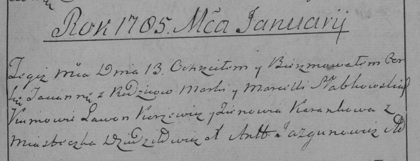

**Слабковский Марко (Słabkowski Marko)**

5 октября 1782 г -- крещение сына Хомы (РГИА 823-2-18, лист 222об,
№7/1782-р (коп)).

13 января 1785 г -- крещение дочери Тацяны (РГИА 823-2-18, лист 228,
№1/1785-р (коп)).

**РГИА 823-2-18:** Лист 222об. **Метрическая запись №7/1782-р (коп).**

{width="6.496527777777778in"
height="2.38125in"}

Дедиловичская униатская церковь. 5 октября 1782 года. Метрическая запись
о крещении.

Słabkowski Tomasz -- сын родителей с местечка Дедиловичи.

Słabkowski Marko -- отец.

Słabkowska Marta -- мать.

Karżewicz Leon -- кум.

Karanowa Zynowia - кума.

Jazgunowicz Antoni -- ксёндз.

**РГИА 823-2-18:** Лист 228. **Метрическая запись №1/1785-р (коп).**

{width="6.496527777777778in"
height="2.4923611111111112in"}

Дедиловичская Покровская церковь. 13 января 1785 года. Метрическая
запись о крещении.

Słabkowska Tacianna -- дочь родителей с местечка Дедиловичи.

Słabkowski Marko -- отец.

Słabkowska Marcella -- мать.

Karżewicz Lawon -- кум.

Karankowa Zienowia - кума.

Jazgunowicz Antoni -- ксёндз.
