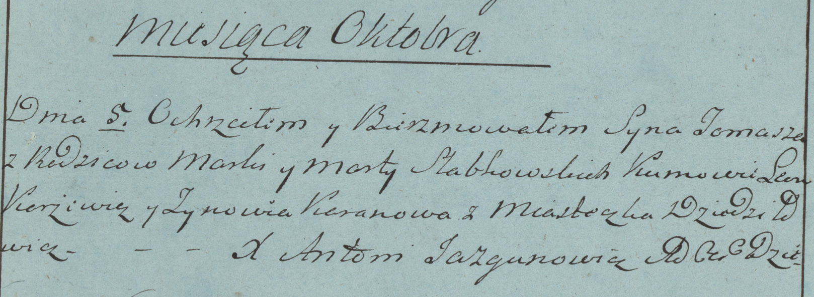

**Слабковский Хома Марков (Słabkowski Tomasz)**

5 октября 1782г -- крещение (РГИА 823-2-18, лист 222об, №7/1782-р
(коп)).

**РГИА 823-2-18:** Лист 222об. **Метрическая запись №7/1782-р (коп).**

Дедиловичская униатская церковь. 5 октября 1782 года. Метрическая запись
о крещении.

Słabkowski Tomasz -- сын родителей с местечка Дедиловичи.

Słabkowski Marko -- отец.

Słabkowska Marta -- мать.

Karżewicz Leon -- кум.

Karanowa Zynowia - кума.

Jazgunowicz Antoni -- ксёндз.
