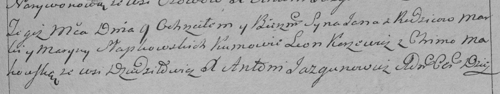

**Слабковский Ян Марков (Słabkowski Jan)**

9 октября 1793г -- крещение (НИАБ 136-13-894, лист 20, №70/1793-р
(ориг)), (РГИА 823-2-18, лист 248, №38/1793-р (коп)).

**НИАБ 136-13-894:** Лист 20-об. **Метрическая запись №70/1793-р
(ориг).**

{width="6.496527777777778in"
height="0.7516371391076115in"}

Дедиловичская Покровская церковь. 9 октября 1793 года. Метрическая
запись о крещении.

Słapkowski Jan -- сын родителей с деревни Дедиловичи.

Słapkowski Marko -- отец.

Słapkowska Maryna-- мать.

Karżewicz Leon - кум.

Makowska Chima - кума.

Jazgunowicz Antoni -- ксёндз.

**РГИА 823-2-18:** Лист 248. **Метрическая запись №38/1793-р (коп).**

{width="6.496527777777778in"
height="1.2319444444444445in"}

Дедиловичская Покровская церковь. 9 октября 1793 года. Метрическая
запись о крещении.

Słapkowski Jan -- сын родителей с деревни Дедиловичи.

Słapkowski Marko -- отец.

Słapkowska Maryna -- мать.

Karżewicz Leon -- кум.

Makowska Chima -- кума.

Jazgunowicz Antoni -- ксёндз.
