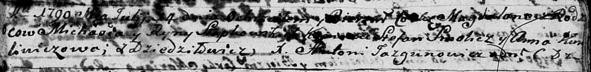

**Слабковская (Шпет) Рына (Słapkowska Ryna)**

14 июля 1790 г -- крещение дочери Магдалены (НИАБ 136-13-894, лист 10,
№40/1790-р (ориг)).

12 сентября 1791 г -- венчание с Яном Шпетом с деревни Дедиловичи (НИАБ
136-13-894, лист 70, №18/1791-б (ориг)).

**НИАБ 136-13-894:** Лист 10. **Метрическая запись №40/1790-р (ориг).**

Дедиловичская Покровская церковь. 14 июля 1790 года. Метрическая запись
о крещении.

Słapkowska Magdalena -- дочь родителей с деревни Дедиловичи.

Słapkowski Michaś -- отец.

Słapkowska Ryna -- мать.

Smolicz Stefan - кум.

Kuryliwiczowa Anna - кума.

Jazgunowicz Antoni -- ксёндз.

**НИАБ 136-13-894:** Лист 70. **Метрическая запись №18/1791-б (ориг).**

Дедиловичская Покровская церковь. 12 сентября 1791 года. Метрическая
запись о венчании.

Szpet Jan -- жених, с деревни Дедиловичи.

Słabkowska Aryna -- невеста, вдова, с деревни Дедиловичи.

Wasilewski Jan -- свидетель.

Larczonek Jerzy -- свидетель.

Jazgunowicz Antoni -- ксёндз.
