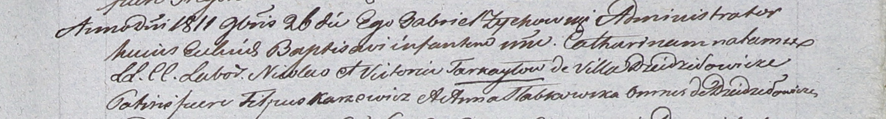

**Слабковская Анна (Słabkowska Anna)**

6 апреля 1808 -- крещение сына Петра (НИАБ 937-4-32, лист 18,
№12/1808-р).

22 октября 1811 г -- крестная мать Марии, дочери Стефана и Барбары Зызов
с деревни Пядань (НИАБ 937-4-32, лист 23об, №18/1811-р).

26 ноября 1811 г -- крестная мать Катарины, дочери Николая и Виктории
Торкайлов с деревни Дедиловичи (НИАБ 937-4-32, лист 24, №21/1811-р).

**НИАБ 937-4-32:** Лист 18. **Метрическая запись №12/1808-р.**

Дедиловичский костел Наисвятейшего Сердца Иисуса. 6 апреля 1808 года.
Метрическая запись о крещении.

Słabkowski Petrus -- сын крестьян с деревни Дедиловичи.

Słabkowski Paul -- отец.

Słabkowska Anna -- мать.

Warawicz Gasper -- крестный отец.

Słabkowska Anastasia -- крестная мать.

Zychowski Gabriel -- ксёндз.

**НИАБ 937-4-32:** Лист 23об. **Метрическая запись №18/1811-р.**

Дедиловичский костел Наисвятейшего Сердца Иисуса. 22 октября 1811 года.
Метрическая запись о крещении.

Zyzowna Maria -- дочь крестьян с деревни Пядань.

Zyz Stephan -- отец.

Zyzowa Barbara -- мать.

Browka Maxim -- крестный отец.

Słabkowska Anna -- крестная мать, с деревни Дедиловичи.

Zychowski Gabriel -- ксёндз.

**НИАБ 937-4-32:** Лист 24. **Метрическая запись №21/1811-р.**

Дедиловичский костел Наисвятейшего Сердца Иисуса. 26 ноября 1811 года.
Метрическая запись о крещении.

Tarkayłowna Catharina -- дочь крестьян с деревни Дедиловичи.

Tarkayło Nicołay -- отец.

Tarkayłowa Victoria -- мать.

Karzewicz Filipus -- крестный отец, с деревни Дедиловичи.

Słabkowska Anna -- крестная мать, с деревни Дедиловичи.

Zychowski Gabriel -- ксёндз.
