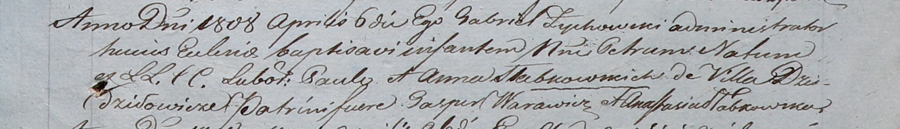

**Слабковский Павел (Słabkowski Paul)**

6 апреля 1808 -- крещение сына Петра (НИАБ 937-4-32, лист 18,
№12/1808-р).

**НИАБ 937-4-32:** Лист 18. **Метрическая запись №12/1808-р.**

Дедиловичский костел Наисвятейшего Сердца Иисуса. 6 апреля 1808 года.
Метрическая запись о крещении.

Słabkowski Petrus -- сын крестьян с деревни Дедиловичи.

Słabkowski Paul -- отец.

Słabkowska Anna -- мать.

Warawicz Gasper -- крестный отец.

Słabkowska Anastasia -- крестная мать.

Zychowski Gabriel -- ксёндз.
