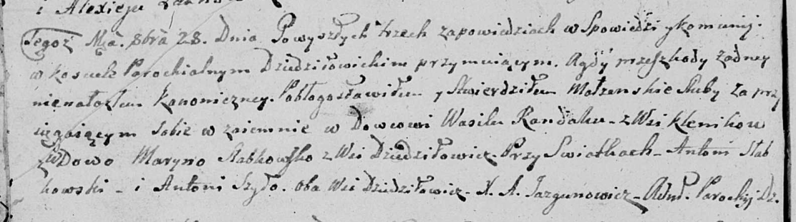

**Рандак (в первом браке Слабковская) Марына (Randakowa Słabkowska)
Maryna)**

28 октября 1807 г -- венчание с вдовцом Василём Рандаком с деревни
Клинники (НИАБ 136-13-920, лист 12об, №5/1807-б (ориг)).

**НИАБ 136-13-920:** Лист 12об. **Метрическая запись №6/1807-б (ориг).**

Дедиловичская Покровская церковь. 28 октября 1807 года. Метрическая
запись о венчании.

Randak Wasil -- жених, вдовец, с деревни Клинники.

Słabkowska Maryna -- невеста, вдова, с деревни Дедиловичи.

Słabkowski Antoni -- свидетель, с деревни Дедиловичи.

Szyło Antoni -- свидетель, с деревни Дедиловичи.

Jazgunowicz Antoni -- ксёндз.
