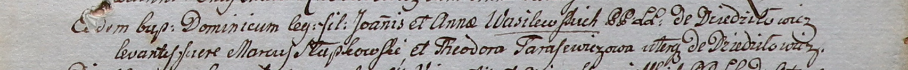

**Слабковский Марко (Słabkowski Marko)**

5 августа 1800 г -- крестный отец Доминика, сына Яна и Анны Василевских
с деревни Дедиловичи (НИАБ 937-4-32, лист 2, №25/1800-р).

**НИАБ 937-4-32:** Лист 2. **Метрическая запись №25/1800-р.**

Дедиловичский костел Наисвятейшего Сердца Иисуса. 5 августа 1800 года.
Метрическая запись о крещении.

Wasilewski Dominic -- сын крестьян с деревни Дедиловичи.

Wasilewski Joann -- отец.

Wasilewska Anna -- мать.

Słapkowski Marcus -- крестный отец, с деревни Дедиловичи.

Tarasewiczowa Theodora -- крестная мать, с деревни Дедиловичи.

Linhart Hyacinthus -- ксёндз.
