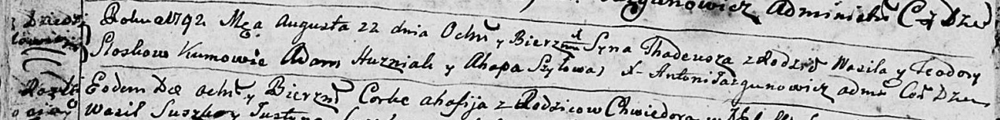
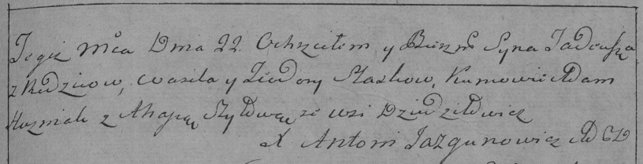
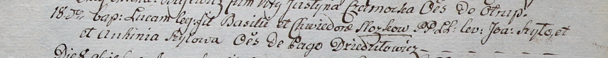

**Слёзка Василь (Sloska Wasil, Basili)**

22 августа 1792 г -- крещение сына Тадея (НИАБ 136-13-894, лист 16об,
№48/1792-р (ориг)), РГИА 823-2-18, лист 245, №22/1792-р (коп)).

18 октября 1800 г -- крещение сына Луки (НИАБ 937-4-32, лист 3,
№35/1800-р).

**НИАБ 136-13-894:** Лист 16об. **Метрическая запись №48/1792-р
(ориг).**

Дедиловичская Покровская церковь. 22 августа 1792 года. Метрическая
запись о крещении.

Słozka Thadeusz -- сын родителей с деревни Дедиловичи.

Słozka Wasil -- отец.

Słozkowa Teodora -- мать.

Huzniak Adam - кум.

Szyłowa Ahapa - кума.

Jazgunowicz Antoni -- ксёндз.

**РГИА 823-2-18:** Лист 245. **Метрическая запись №22/1792-р (коп).**

Дедиловичская Покровская церковь. 22 августа 1792 года. Метрическая
запись о крещении.

Słoska Tadeusz -- сын родителей с деревни Дедиловичи.

Słoska Wasil -- отец.

Słoskowa Teodora -- мать.

Huzniak Adam -- кум.

Szyłowa Ahapa -- кума.

Jazgunowicz Antoni -- ксёндз.

**НИАБ 937-4-32:** Лист 3. **Метрическая запись №35/1800-р.**

Дедиловичский костел Наисвятейшего Сердца Иисуса. 18 октября 1800 года.
Метрическая запись о крещении.

Slozka Łuca -- сын крестьян с деревни Дедиловичи.

Slozka Basili -- отец.

Slozkowa Chwiedora -- мать.

Szyło Joann -- крестный отец, с деревни Дедиловичи.

Szyłowa Auchinia -- крестная мать, с деревни Дедиловичи.

Linhart Hyacinthus -- ксёндз.
