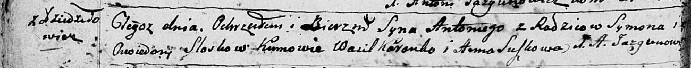
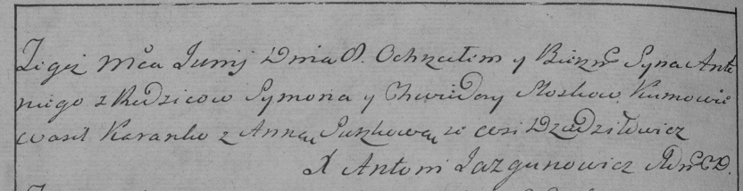

**Слёзка Антон Сымонов (Sloska Antoni)**

8 июня 1796 г -- крещение (НИАБ 136-13-894, лист 29об, №60/1796-р
(ориг)), (РГИА 823-2-18, лист 256об, №32/1796-р (коп)).

**НИАБ 136-13-894:** Лист 29-об. **Метрическая запись №60/1796-р
(ориг).**

Дедиловичская Покровская церковь. 8 июня 1796 года. Метрическая запись о
крещении.

Slozka Antoni -- сын родителей с деревни Дедиловичи.

Slozka Symon -- отец.

Slozkowa Chwiedora -- мать.

Karańko Wasil - кум.

Suszkowa Anna - кума.

Jazgunowicz Antoni -- ксёндз.

**РГИА 823-2-18:** Лист 256об. **Метрическая запись №32/1796-р (коп).**

Дедиловичская Покровская церковь. \[8\] июня 1796 года. Метрическая
запись о крещении.

Sloska Antoni -- сын родителей с деревни Дедиловичи.

Sloska Symon -- отец.

Sloskowa Chwiedora -- мать.

Koranko Wasil -- кум.

Suszkowa Anna -- кума.

Jazgunowicz Antoni -- ксёндз.
