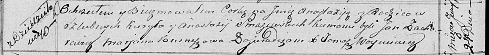

**Смачевская Анастасия (Smaczewska Anastazija)**

24 июня 1817 г -- крещение дочери Анастасии (НИАБ 136-13-894, лист 96об,
№41/1817-р (ориг)).

**НИАБ 136-13-894:** Лист 96об. **Метрическая запись №41/1817-р
(ориг).**

Осовская Покровская церковь. 24 июня 1817 года. Метрическая запись о
крещении.

Smaczewska Anastazija -- дочь родителей с деревни Дедиловичи.

Smaczewski Kuryła -- отец.

Smaczewska Anastazija -- мать.

Zacharewicz Jan -- кум.

Kurneszowa Marjana -- кума.

Woyniewicz Tomasz -- ксёндз.
