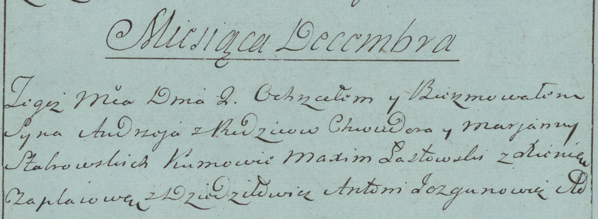

**Стабровская Марьяна (Stabrowska Marjanna)**

2 декабря 1783 г -- крещение сына Андрея (РГИА 823-2-18, лист 225об,
№28/1783-р (коп)).

**РГИА 823-2-18:** Лист 225об. **Метрическая запись №28/1783-р (коп).**

Дедиловичская Покровская церковь. 2 декабря 1783 года. Метрическая
запись о крещении.

Stabrowski Andrzey -- сын родителей с деревни Дедиловичи.

Stabrowski Chwiedor -- отец.

Stabrowska Marjanna -- мать.

Łastowski Maxim -- кум.

Czaplaiowa Xienia - кума.

Jazgunowicz Antoni -- ксёндз.
