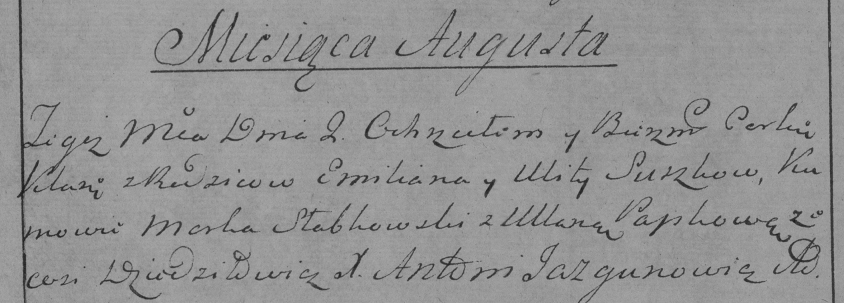

**Сушко Емельян (Suszko Emilian)**

27 октября 1782 г -- крещение сына Якова (РГИА 823-2-18, лист 222об,
№11/1782-р (коп)).

2 августа 1784 г -- крещение дочери Кляры (РГИА 823-2-18, лист 227,
№16/1784-р (коп)).

**РГИА 823-2-18:** Лист 222об. **Метрическая запись №11/1782-р (коп).**

{width="6.496527777777778in"
height="1.6944444444444444in"}

Дедиловичская Покровская церковь. 27 октября 1782 года. Метрическая
запись о крещении.

Suszko Jakow -- сын родителей с местечка Дедиловичи.

Suszko Emilian -- отец.

Suszkowa Ulita -- мать.

Słabkowski Marka -- кум.

Papkowna Uljana - кума.

Jazgunowicz Antoni -- ксёндз.

**РГИА 823-2-18:** Лист 227. **Метрическая запись №16/1784-р (коп).**

{width="6.496527777777778in"
height="2.3319444444444444in"}

Дедиловичская Покровская церковь. 2 августа 1784 года. Метрическая
запись о крещении.

Suszkowna Klara -- дочь родителей с деревни Дедиловичи.

Suszko Emilian -- отец.

Suszkowa Ulita -- мать.

Słabkowski Marko -- кум.

Papkowa Ullana - кума.

Jazgunowicz Antoni -- ксёндз.
