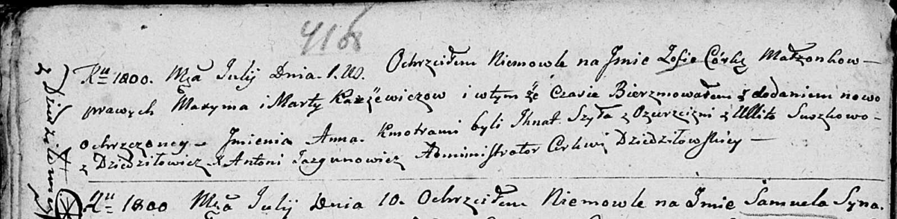

**Сушко Улита (Suszkowa Ulita)**

27 октября 1782г -- крещение сына Якова (РГИА 823-2-18, лист 222об,
№11/1782-р (коп)).

2 августа 1784 г -- крещение дочери Кляры (РГИА 823-2-18, лист 227,
№16/1784-р (коп)).

1 июля 1800 г -- крестная мать Зофии Анны, дочери Каржевичей Максыма и
Марты с деревни Дедиловичи (НИАБ 136-13-894, лист 41об, №15/1800-р
(ориг), НИАБ 136-13-949, лист 102, №16/1800-р (коп)).

22 мая 1802 г -- крестная мать Петронели, дочери Адамы и Рыны Гузняков с
деревни Дедиловичи (НИАБ 937-4-32, лист 6об, №11/1802-р).

28 ноября 1802 г -- крестная мать Адама, сына Леона и Софии Каржевичей с
деревни Дедиловичи (НИАБ 937-4-32, лист 8, №44/1802-р).

**РГИА 823-2-18:** Лист 222об. **Метрическая запись №11/1782-р (коп).**

{width="6.496527777777778in"
height="1.6944444444444444in"}

Дедиловичская Покровская церковь. 27 октября 1782 года. Метрическая
запись о крещении.

Suszko Jakow -- сын родителей с местечка Дедиловичи.

Suszko Emilian -- отец.

Suszkowa Ulita -- мать.

Słabkowski Marka -- кум.

Papkowna Uljana - кума.

Jazgunowicz Antoni -- ксёндз.

**РГИА 823-2-18:** Лист 227. **Метрическая запись №16/1784-р (коп).**

{width="6.496527777777778in"
height="2.3319444444444444in"}

Дедиловичская Покровская церковь. 2 августа 1784 года. Метрическая
запись о крещении.

Suszkowna Klara -- дочь родителей с деревни Дедиловичи.

Suszko Emilian -- отец.

Suszkowa Ulita -- мать.

Słabkowski Marko -- кум.

Papkowa Ullana - кума.

Jazgunowicz Antoni -- ксёндз.

**НИАБ 136-13-894:** Лист 41об. **Метрическая запись №15/1800-р
(ориг).**

{width="6.496527777777778in"
height="1.5937915573053367in"}

Дедиловичская Покровская церковь. 1 июля 1800 года. Метрическая запись о
крещении.

Karżewiczowna Zofia Anna -- дочь родителей с деревни Дедиловичи.

Karżewicz Maxym -- отец.

Karżewiczowa Marta -- мать.

Szyło Jhnat -- кум, с деревни Озерщизна.

Suszkowa Ullita -- кума, с деревни Дедиловичи.

Jazgunowicz Antoni -- ксёндз

**НИАБ 136-13-949:** Лист 102. **Метрическая запись №16/1800-р (коп).**

(См. тж.: РГИА 823-2-18, лист 276, №14/1800-р (коп), НИАБ 136-13-894,
лист 41j,, №15/1800-р (ориг))

{width="6.496527777777778in"
height="2.8555555555555556in"}

Дедиловичская Покровская церковь. 1 июля 1800 года. Метрическая запись о
крещении.

Kuszniarewiczowna \[Karżewiczowna\] Zofia Anna -- дочь родителей с
деревни \[Дедиловичи\].

Kuszniarewicz \[Karżewicz\] Maxim -- отец.

Kuszniarewiczowa \[Karżewiczowa\] Marta -- мать.

Szyło Jhnat -- кум, с деревни Дедиловичи \[Озерщизна\].

Suszkowa Ulita - кума, с деревни Дедиловичи.

Jazgunowicz Antoni -- ксёндз.

**НИАБ 937-4-32:** Лист 6об. **Метрическая запись №11/1802-р.**

{width="6.496527777777778in"
height="0.8923611111111112in"}

Дедиловичский костел Наисвятейшего Сердца Иисуса. 22 мая 1802 года.
Метрическая запись о крещении.

\[Huzniakowna\] Petronella -- дочь крестьян с деревни Дедиловичи.

\[Huzniak\] Adam -- отец.

\[Huzniakowa\] Aryna -- мать.

Broucha Paul -- крестный отец.

Suszkowa Ulyta -- крестная мать, с деревни Дедиловичи.

Linhart Hyacinthus -- ксёндз.

**НИАБ 937-4-32:** Лист 8. **Метрическая запись №44/1802-р.**

{width="6.496527777777778in"
height="0.8888888888888888in"}

Дедиловичский костел Наисвятейшего Сердца Иисуса. 28 ноября 1802 года.
Метрическая запись о крещении.

Karzewicz Adam -- сын крестьян с деревни Дедиловичи.

Karzewicz Leon -- отец.

Karzewiczowa Sophia -- мать.

Sawicki Damian -- крестный отец.

Suszkowna Ulita -- крестная мать, с деревни Дедиловичи.

Linhart Hyacinthus -- ксёндз.
