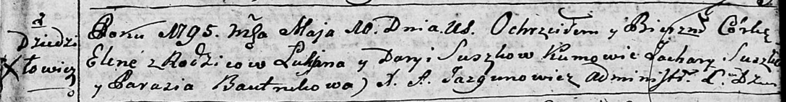
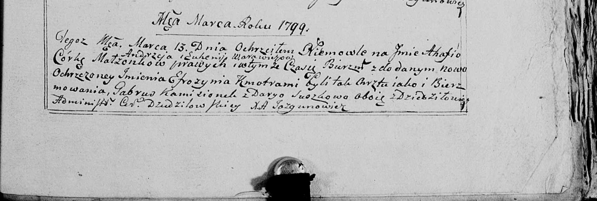
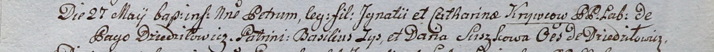

**Сушко Дарья (Suszko Daryia)**

10 мая 1795 г -- крещение дочери Елены (НИАБ 136-13-894, лист 24,
№10/1795-р (ориг)).

13 марта 1799 г -- крестная мать Агафии Параскевии, дочери Варавичей
Андрея и Евгении с деревни Пядань (НИАБ 136-13-938, лист 241, №15/1799-р
(коп)).

27 мая 1800 г -- крестная мать Петра, сына Игнатия и Катерины Сушков с
деревни Дедиловичи (НИАБ 837-4-32, лист 2, №16/1800-р).

**НИАБ 136-13-894:** Лист 24. **Метрическая запись №10/1795-р (ориг).**

Дедиловичская Покровская церковь. 10 мая 1795 года. Метрическая запись о
крещении.

Suszkowna Elena -- дочь родителей с деревни Дедиловичи.

Suszko Łukjan -- отец.

Suszkowa Daryia -- мать.

Suszko Zachary - кум.

Bautrukowa Parasia - кума.

Jazgunowicz Antoni -- ксёндз.

**НИАБ 136-13-938:** Лист 241. **Метрическая запись №15/1799-р (коп).**

(См. тж. НИАБ 136-13-894, лист 38об, №15/1799-р (ориг); РГИА 823-2-18,
лист 268об, №15/1799-р (коп))

Дедиловичская Покровская церковь. 13 марта 1799 года. Метрическая запись
о крещении.

Warawiczowna Ahafia Efrozynia -- дочь родителей с деревни \[Пядань\].

Warawicz Andrzey -- отец.

Warawiczowa Euhenija -- мать.

Kamisionek Gabruś -- кум, с деревни Дедиловичи.

Suszkowa Darya - кума, с деревни Дедиловичи.

Jazgunowicz Antoni -- ксёндз.

**НИАБ 937-4-32:** Лист 2. **Метрическая запись №16/1800-р.**

Дедиловичский костел Наисвятейшего Сердца Иисуса. 27 мая 1800 года.
Метрическая запись о крещении.

Krywiec Petrus -- сын крестьян с деревни Дедиловичи.

Krywiec Jgnati -- отец.

Krywcowa Catharina -- мать.

Zys Basili -- крестный отец.

Suszkowa Daria -- крестная мать, с деревни Дедиловичи.

Linhart Hyacinthus -- ксёндз.
