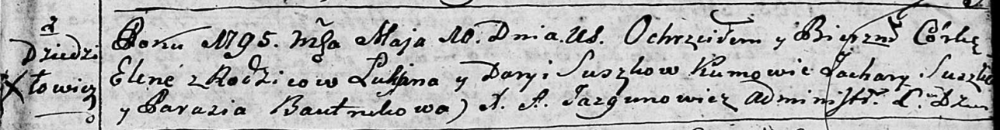

**Сушко Лукьян (Suszko Łukjan)**

22 октября 1794 г -- свидетель при венчании Курылы Кривца со двора
Дедиловичи и Марты Юхневич с деревни Пядань (НИАБ 136-13-920, лист 1,
№7/1794-б (ориг)).

10 мая 1795 г -- крещение дочери Елены (НИАБ 136-13-894, лист 24,
№10/1795-р (ориг)).

**НИАБ 136-13-920:** Лист 1. **Метрическая запись №7/1794-б (ориг).**

{width="6.496527777777778in"
height="1.2055686789151356in"}

Дедиловичская Покровская церковь. 22 октября 1794 года. Метрическая
запись о венчании.

Krywiec Kuryła -- жених, двор Дедиловичи.

Juchniewiczowna Marta -- невеста, деревня Пядань.

Suszko Łukian -- свидетель, деревня Дедиловичи.

Czaplay Chwiedor -- свидетель, деревня Отруб.

Jazgunowicz Antoni -- ксёндз.

**НИАБ 136-13-894:** Лист 24. **Метрическая запись №10/1795-р (ориг).**

{width="6.496527777777778in"
height="0.8481889763779528in"}

Дедиловичская Покровская церковь. 10 мая 1795 года. Метрическая запись о
крещении.

Suszkowna Elena -- дочь родителей с деревни Дедиловичи.

Suszko Łukjan -- отец.

Suszkowa Daryia -- мать.

Suszko Zachary - кум.

Bautrukowa Parasia - кума.

Jazgunowicz Antoni -- ксёндз.
