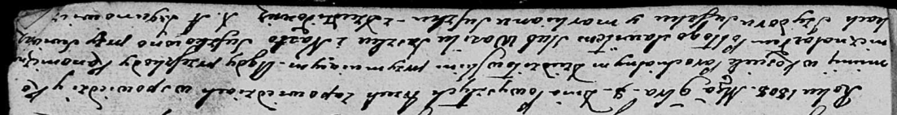
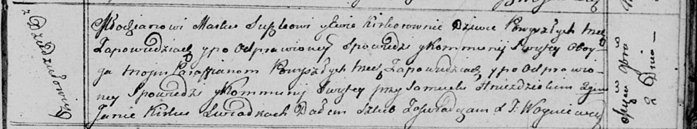

**Сушко Маркиан, Марко (Suszko Markian, Marko)**

2 ноября 1813 г -- венчание с девкой Евой Керко с деревни Дедиловичи
(НИАБ 136-13-920, лист 20, №17/1813-б (ориг)).

8 ноября 1808 г -- свидетель венчания Сушко Василя с деревни Разлитье с
Настой Сушко (НИАБ 136-13-920, лист 14, №10/1808-б (ориг)).

**НИАБ 136-13-920:** Лист 14. **Метрическая запись №10/1808-б (ориг).**

Дедиловичская Покровская церковь. 8 ноября 1808 года. Метрическая запись
о венчании.

Suszko Wasil -- жених, с деревни \[Разлитье\].

Suszkowna Nasta -- невеста.

Suszko Jzydor -- свидетель.

Suszko Markian -- свидетель, с деревни Дедиловичи.

Jazgunowicz Antoni -- ксёндз.

**НИАБ 136-13-920:** Лист 20. **Метрическая запись №17/1813-б (ориг).**

Осовская Покровская церковь. 2 ноября 1813 года. Запись о венчании.

Suszko Markо -- жених, молодой, парафии Осовской, с деревни Дедиловичи.

Kirkowna Ewa -- невеста, девка, парафии Осовской, с деревни Дедиловичи.

Hniezdzicki Samuel -- свидетель.

Kirka Jan -- свидетель.

Woyniewicz Tomasz -- ксёндз.
