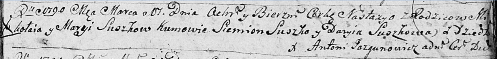

**Сушко Анастасья Миколаева (Suszkowna Anastzazya)**

17 марта 1790 г -- крещение (НИАБ 136-13-894, лист 9, №18/1790-р
(ориг)).

**НИАБ 136-13-894:** Лист 9. **Метрическая запись №18/1790-р (ориг).**

Дедиловичская Покровская церковь. 17 марта 1790 года. Метрическая запись
о крещении.

Suszkowna Nastazya -- дочь родителей с деревни Дедиловичи.

Suszko Mikołaj -- отец.

Suszkowa Marya -- мать.

Suszko Siemion - кум.

Suszkowa Daryia - кума.

Jazgunowicz Antonij -- ксёндз.
