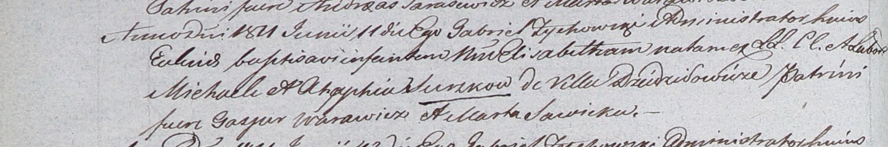

**Сушко Агафия, Апа (Suszkowa Ahafia, Apa)**

9 августа 1803 г -- крещение дочери Настасьи (НИАБ 937-4-32, лист 9об,
№18/1803-р).

29 июля 1806 г -- крещение дочери Анны (НИАБ 937-4-32, лист 13об,
№13/1806-р).

11 июня 1811 г -- крещение дочери Элизабеты (НИАБ 937-4-32, лист 23об,
№11/1811-р).

**НИАБ 937-4-32:** Лист 9об. **Метрическая запись №18/1803-р.**

Дедиловичский костел Наисвятейшего Сердца Иисуса. 9 августа 1803 года.
Метрическая запись о крещении.

Suszkowna Nastazya -- дочь родителей с деревни Дедиловичи.

Suszko Michał -- отец.

Suszkowa Ahafia -- мать.

Warawicz Karpiey -- крестный отец.

Sawicka Marta -- крестная мать.

Galinowski Joann -- ксёндз, комендант Дедиловичского костела.

**НИАБ 937-4-32:** Лист 13об. **Метрическая запись №13/1806-р.**

Дедиловичский костел Наисвятейшего Сердца Иисуса. 29 июля 1806 года.
Метрическая запись о крещении.

Suszkowna Anna -- дочь родителей с деревни Дедиловичи.

Suszko Michael -- отец.

Suszkowa Apa -- мать.

Warawicz Carp -- крестный отец.

Sawicka Helena -- крестная мать.

Skindzelewski Andreas -- ксёндз, комендант Дедиловичский.

**НИАБ 937-4-32:** Лист 23об. **Метрическая запись №11/1811-р.**

Дедиловичский костел Наисвятейшего Сердца Иисуса. 11 июня 1811 года.
Метрическая запись о крещении.

Suszkowna Elisabetha -- дочь крестьян с деревни Дедиловичи.

Suszko Michael -- отец.

Suszkowa Ahaphia -- мать.

Warawicz Gasper -- крестный отец.

Sawicka Marta -- крестная мать.

Zychowski Gabriel -- ксёндз.
