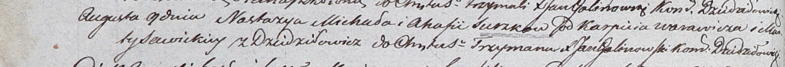

**Сушко Настасья Михалова (Suszkowna Nastazya)**

9 августа 1803 г -- крещение (НИАБ 937-4-32, лист 9об, №18/1803-р).

**НИАБ 937-4-32:** Лист 9об. **Метрическая запись №18/1803-р.**

Дедиловичский костел Наисвятейшего Сердца Иисуса. 9 августа 1803 года.
Метрическая запись о крещении.

Suszkowna Nastazya -- дочь родителей с деревни Дедиловичи.

Suszko Michał -- отец.

Suszkowa Ahafia -- мать.

Warawicz Karpiey -- крестный отец.

Sawicka Marta -- крестная мать.

Galinowski Joann -- ксёндз, комендант Дедиловичского костела.
