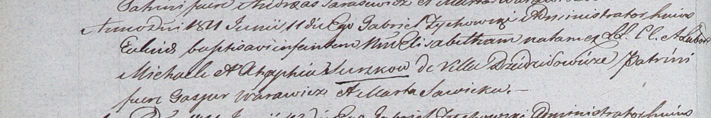

**Сушко Элизабета Михалова (Suszkowna Elisabetha)**

11 июня 1811 г -- крещение (НИАБ 937-4-32, лист 23об, №11/1811-р).

**НИАБ 937-4-32:** Лист 23об. **Метрическая запись №11/1811-р.**

{width="6.496527777777778in"
height="1.0798611111111112in"}

Дедиловичский костел Наисвятейшего Сердца Иисуса. 11 июня 1811 года.
Метрическая запись о крещении.

Suszkowna Elisabetha -- дочь крестьян с деревни Дедиловичи.

Suszko Michael -- отец.

Suszkowa Ahaphia -- мать.

Warawicz Gasper -- крестный отец.

Sawicka Marta -- крестная мать.

Zychowski Gabriel -- ксёндз.
