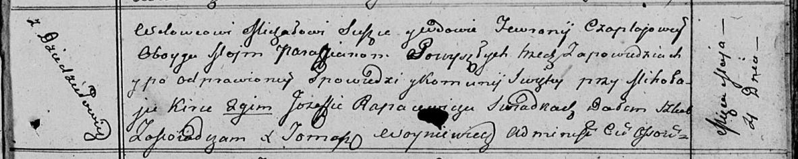

**Сушко Михал (Suszko Michał)**

4 мая 1813 г -- венчание с вдовой Февронией Чапляй с деревни Дедиловичи
(НИАБ 136-13-920, лист 19, №6/1813-б (ориг)).

24 июля 1817 г -- крещение сына Адама (НИАБ 136-13-894, лист 97,
№46/1817-р (ориг)).

**НИАБ 136-13-920:** Лист 19. **Метрическая запись №6/1813-б (ориг).**

Осовская Покровская церковь. 4 мая 1813 года. Запись о венчании.

Suszko Michał -- жених, вдовец, парафии Осовской, с деревни Дедиловичи.

Czapłajowa Fewronia -- невеста, вдова, парафии Осовской, с деревни
Дедиловичи.

Kirko Mikołay -- свидетель.

Rapaсewicz Jozef -- свидетель.

Woyniewicz Tomasz -- ксёндз.

**НИАБ 136-13-894:** Лист 97. **Метрическая запись №46/1817-р (ориг).**

Осовская Покровская церковь. 24 июля 1817 года. Метрическая запись о
крещении.

Suszko Adam -- сын родителей с деревни Дедиловичи.

Suszko Michał -- отец.

Suszkowna Fewronija -- мать.

Warawicz Karpiey -- кум.

Zyzowa Anna -- кума.

Woyniewicz Tomasz -- ксёндз.
