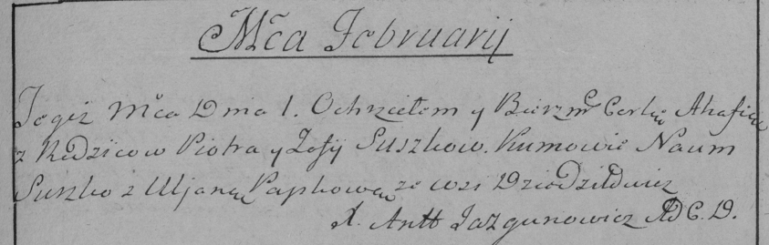

**Сушко Зофия (Suszkowa Zofija)**

1 февраля 1786 г -- крещение дочери Агафии (РГИА 823-2-18, лист 231,
№4/1786-р (коп)).

**РГИА 823-2-18:** Лист 231. **Метрическая запись №4/1786-р (коп).**

Дедиловичская Покровская церковь. 1 февраля 1786 года. Метрическая
запись о крещении.

Suszkowna Ahafia -- дочь родителей с деревни Дедиловичи.

Suszko Piotr -- отец.

Suszkowa Zofija -- мать.

Suszko Naum -- кум.

Papkowa Uljana - кума.

Jazgunowicz Antoni -- ксёндз.
